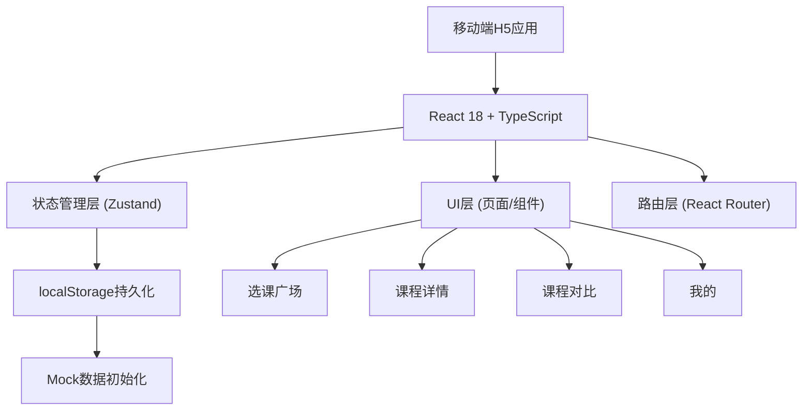
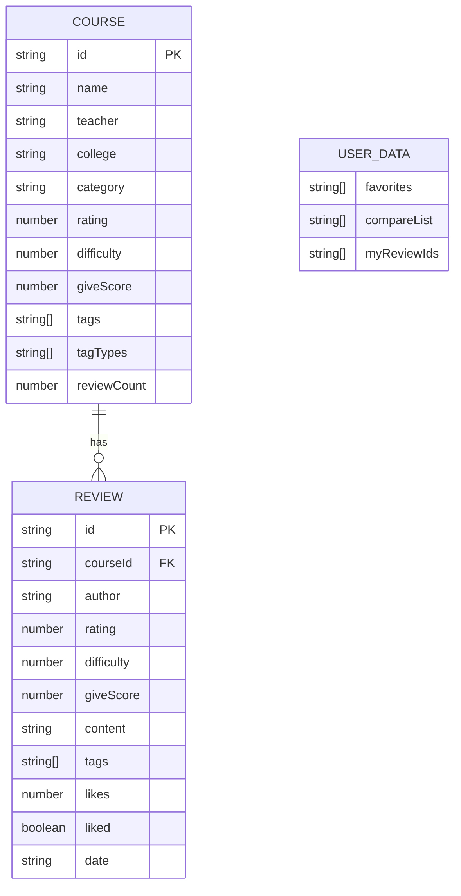

## 1. 架构设计



## 2. 技术描述
- **前端框架**：React@18 + TypeScript
- **构建工具**：Vite
- **样式方案**：TailwindCSS@3
- **路由管理**：React Router DOM@6
- **状态管理**：Zustand
- **图标库**：Lucide React
- **数据存储**：localStorage（纯前端，无后端）

## 3. 路由定义
| 路由 | 目的 |
|------|------|
| / | 选课广场（首页） |
| /course/:id | 课程详情页 |
| /compare | 课程对比页 |
| /mine | 我的页面 |

## 4. 数据模型

### 4.1 数据模型定义


### 4.2 数据存储键名
- `course_data`: 所有课程及评价数据
- `user_data`: 用户操作数据（收藏、对比、我的评价ID）

## 5. 项目结构
```
src/
├── components/          # 公共组件
│   ├── BottomTab.tsx    # 底部Tab导航
│   ├── CourseCard.tsx   # 课程卡片
│   ├── StarRating.tsx   # 星级评分
│   ├── TagBadge.tsx     # 标签徽章
│   ├── ReviewItem.tsx   # 评价列表项
│   ├── ReviewModal.tsx  # 写评价弹窗
│   └── Toast.tsx        # Toast提示
├── pages/               # 页面
│   ├── Home.tsx         # 选课广场
│   ├── CourseDetail.tsx # 课程详情
│   ├── Compare.tsx      # 课程对比
│   └── Mine.tsx         # 我的
├── store/               # 状态管理
│   └── useStore.ts      # Zustand Store
├── data/                # Mock数据
│   └── mockData.ts      # 预设课程数据
├── utils/               # 工具函数
│   ├── storage.ts       # localStorage封装
│   └── helpers.ts       # 辅助函数
├── types/               # 类型定义
│   └── index.ts         # TypeScript类型
├── App.tsx
├── main.tsx
└── index.css
```
