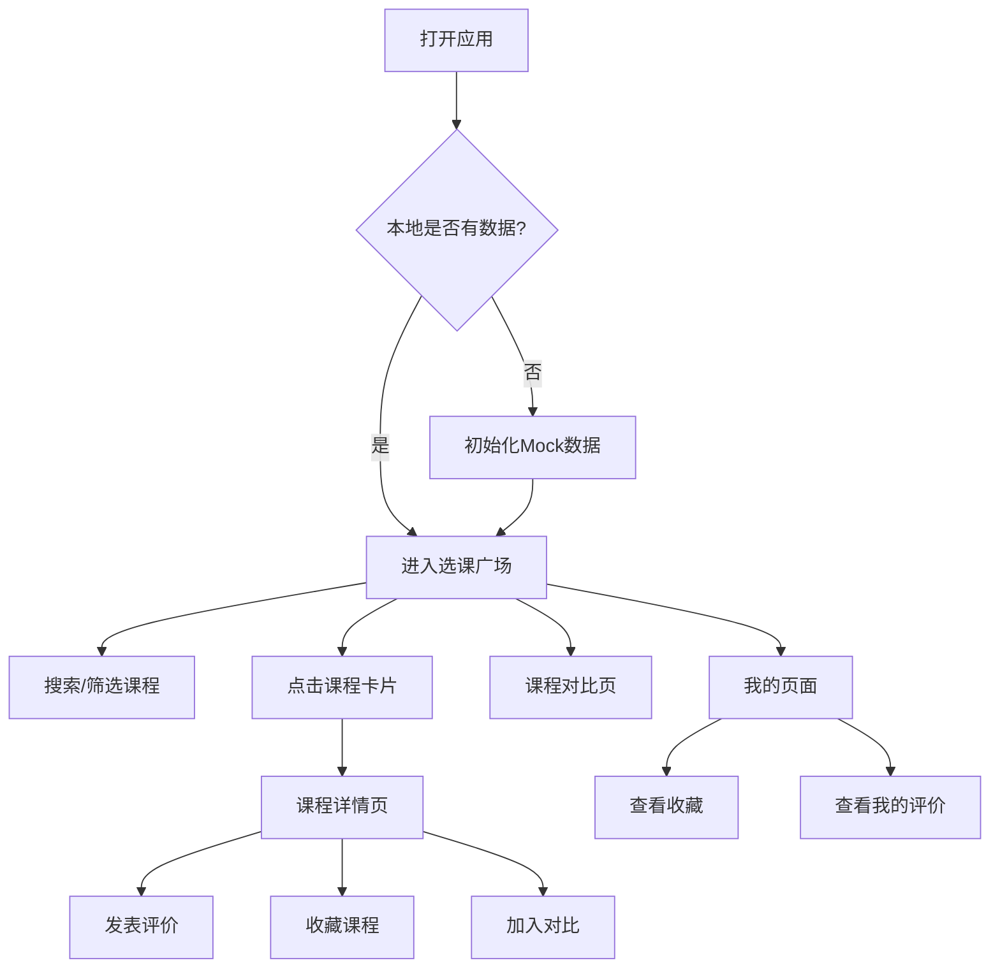

## 1. 产品概述

大学选课评价与避坑指南是一款运行在手机浏览器中的轻量H5工具，帮助学生在上课前查看课程的真实评价，识别"坑课"与"神仙课"。

- 核心目标：让学生快速获取课程真实评价，避免踩坑，选到优质课程
- 目标用户：在校大学生
- 产品价值：降低选课信息不对称，提升选课决策质量

## 2. 核心功能

### 2.1 用户角色
| 角色 | 注册方式 | 核心权限 |
|------|----------|----------|
| 学生用户 | 无需注册，直接使用 | 浏览课程、查看评价、发表评价、收藏课程、课程对比 |

### 2.2 功能模块
1. **选课广场（首页）**：课程列表展示、搜索、筛选、快捷收藏/对比
2. **课程详情页**：数据概览、标签墙、评价列表、写评价入口
3. **写评价弹窗**：多维度评分、标签选择、文字评价
4. **课程对比页**：最多3门课程的核心指标横向对比
5. **我的页**：收藏课程、我的评价记录、数据清除

### 2.3 页面详情
| 页面名称 | 模块名称 | 功能描述 |
|----------|----------|----------|
| 选课广场 | 搜索与筛选 | 支持按课程名、教师名、学院模糊搜索；横向滑动筛选标签 |
| 选课广场 | 课程卡片 | 展示课程名、教师、学院、综合推荐分、评价条数、难度星级、给分慷慨度、关键标签 |
| 选课广场 | 快捷操作 | 一键收藏、加入对比、写评价 |
| 课程详情 | 数据概览 | 综合推荐分、难度值、给分慷慨度、评价总数可视化展示 |
| 课程详情 | 标签墙 | 高频标签彩色展示（正面/负面/中性） |
| 课程详情 | 评价列表 | 按时间倒序展示所有评价，支持点赞 |
| 课程详情 | 操作入口 | 写评价、收藏、加入对比 |
| 写评价 | 评分维度 | 综合推荐度、课程难度、给分慷慨度星级评分 |
| 写评价 | 标签选择 | 预设常用标签多选 |
| 写评价 | 文字评价 | 多行文本输入（最少10字） |
| 课程对比 | 对比表格 | 核心数据并排对比展示 |
| 课程对比 | 移除操作 | 移除对比课程 |
| 我的 | 我的收藏 | 已收藏课程列表 |
| 我的 | 我的评价 | 已发表评价列表 |
| 我的 | 数据清除 | 二次确认清除所有本地数据 |

## 3. 核心流程

用户打开应用 → 首次访问初始化Mock数据 → 浏览选课广场 → 搜索/筛选课程 → 查看课程详情 → 发表评价/收藏/加入对比 → 在我的页管理收藏和评价 → 在对比页横向比较课程

## 4. 用户界面设计

### 4.1 设计风格
- **主色调**：蓝色系（#3B82F6）作为主色，代表专业与信任
- **辅助色**：绿色（#10B981）代表高分好评，橙色（#F59E0B）代表中等，红色（#EF4444）代表低分警告
- **按钮风格**：圆角胶囊形按钮，点击有微弹动效果
- **字体**：使用系统字体（-apple-system, BlinkMacSystemFont, "PingFang SC", "Helvetica Neue"）
- **布局风格**：卡片式布局，底部Tab导航，移动端优先
- **图标风格**：Lucide图标库，简洁线性风格

### 4.2 页面设计概述
| 页面名称 | 模块名称 | UI元素 |
|----------|----------|--------|
| 选课广场 | 顶部搜索 | 搜索框、横向滚动筛选标签 |
| 选课广场 | 课程卡片 | 白色圆角卡片，阴影，评分大号彩色数字，标签彩色徽章 |
| 课程详情 | 数据概览 | 大号评分数字，进度条展示难度/给分 |
| 课程详情 | 标签墙 | 圆角彩色标签，红色负面标签醒目 |
| 课程详情 | 评价列表 | 头像、星级、评价内容、点赞按钮 |
| 课程对比 | 对比表格 | 固定首列，横向滚动，颜色区分优劣 |
| 我的 | 分区列表 | 收藏与评价分开展示，头像与欢迎语 |
| 全局 | 底部Tab | 四个Tab，激活态蓝色高亮 |

### 4.3 响应式
- 移动端优先（Mobile First），适配 iPhone SE ~ iPhone 15 Pro Max 及主流安卓机型
- 宽度适配：320px ~ 480px
- 触摸优化：按钮最小点击区域 44x44px
- 适配微信内置浏览器

### 4.4 动效设计
- 页面切换：左右滑入效果
- 卡片点击：轻微缩放反馈
- 点赞/收藏：心形图标填充动画
- Toast提示：从底部滑入淡出
- 评分星星：悬停/点击高亮过渡
